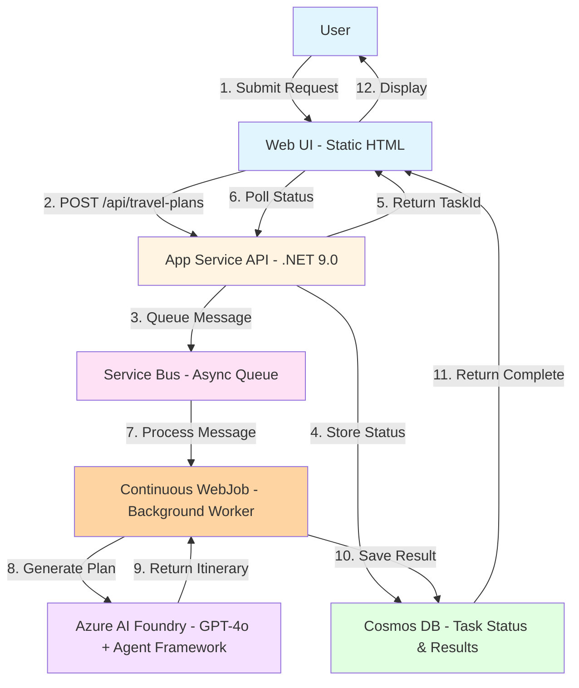

# App Service Microsoft Agent Framework Multi-Agent Workflow Travel Planner With WebJob

A demonstration of building asynchronous, long-running AI applications using **multi-agent workflows** with the [Microsoft Agent Framework](https://learn.microsoft.com/en-us/agent-framework/overview/agent-framework-overview) on Azure App Service. This sample showcases **code-generated multi-agent orchestration** with 6 specialized AI agents, external API integrations (weather, currency), and background processing with Service Bus and Cosmos DB.

> **🆕 What's Different?**  
> This sample demonstrates **advanced multi-agent patterns** with code-generated workflow orchestration, whereas the [original single-agent sample](https://github.com/Azure-Samples/app-service-agent-framework-travel-agent-dotnet-webjob) uses a single Foundry-portal agent. This version creates 6 specialized agents in code (Currency Converter, Weather Advisor, Local Knowledge, Itinerary Planner, Budget Optimizer, Coordinator) that collaborate through a 4-phase workflow with parallel and sequential execution.

See the original blog post for context on getting started: [Build Long-Running AI Agents on Azure App Service with Microsoft Agent Framework](https://techcommunity.microsoft.com/blog/appsonazureblog/build-long-running-ai-agents-on-azure-app-service-with-microsoft-agent-framework/4463159)

> **Architecture Note:**  
> Like the original sample, this uses WebJobs for background processing on App Service, providing better separation of concerns, independent restarts, and dedicated logging. To learn more about WebJobs on App Service, see the [Azure App Service WebJobs documentation](https://learn.microsoft.com/azure/app-service/overview-webjobs).

## Multi-Agent Architecture

This sample demonstrates a **code-generated multi-agent workflow** where specialized AI agents collaborate to create comprehensive travel plans:

### 🤖 Specialized Agents

1. **Currency Converter Agent** - Provides real-time exchange rates and budget conversion using the Frankfurter API (European Central Bank rates)
2. **Weather Advisor Agent** - Fetches weather forecasts and packing recommendations using the National Weather Service API (US destinations)
3. **Local Knowledge Agent** - Offers destination-specific cultural tips, customs, and local insights
4. **Itinerary Planner Agent** - Creates detailed day-by-day schedules with activities, meals, and attractions
5. **Budget Optimizer Agent** - Allocates budget across categories and provides cost-saving recommendations
6. **Coordinator Agent** - Orchestrates the workflow and assembles the final travel plan

### 🔄 Workflow Phases

**Phase 1: Parallel Information Gathering (10-40%)**
- Currency, Weather, and Local Knowledge agents work simultaneously
- No-auth external APIs provide real-time data (NWS Weather, Frankfurter Currency)
- Results stored in workflow state for downstream agents

**Phase 2: Itinerary Planning (40-70%)**
- Itinerary Planner agent creates detailed daily schedule
- Uses context from Phase 1 (weather, local knowledge)
- Generates activities, dining recommendations, and attractions

**Phase 3: Budget Optimization (70-90%)**
- Budget Optimizer analyzes itinerary and allocates funds
- Provides category-wise breakdown and cost-saving tips
- Ensures plan fits within specified budget

**Phase 4: Final Assembly (90-100%)**
- Coordinator agent compiles all agent outputs
- Formats comprehensive travel plan with tips and recommendations
- Returns structured itinerary to user

### 🎯 Why Multi-Agent?

**✅ Separation of Concerns**: Each agent has a single, focused responsibility  
**✅ Parallel Execution**: Independent agents run simultaneously for faster results  
**✅ Specialized Expertise**: Agents have domain-specific instructions and tools  
**✅ Code-First DevOps**: All agents defined in C# - no portal configuration needed  
**✅ Version Control**: Agent definitions tracked in Git alongside application code  
**✅ Reusability**: Agents can be used in other workflows or applications  
**✅ Maintainability**: Easy to update, test, or replace individual agents  
**✅ Scalability**: Workflow can scale horizontally across Service Bus consumers

### 🌐 External API Integration (No Authentication Required)

This sample integrates with free, public APIs to enhance travel planning with real-world data:

**National Weather Service (NWS) API**
- **Endpoint**: `https://api.weather.gov`
- **Purpose**: 7-day weather forecasts for US destinations
- **Authentication**: None required (US government public API)
- **Data**: Temperature, conditions, precipitation probability
- **Usage**: Weather Advisor Agent provides packing recommendations and activity suggestions

**Frankfurter Currency API**
- **Endpoint**: `https://api.frankfurter.app`
- **Purpose**: Real-time currency exchange rates
- **Authentication**: None required (European Central Bank data)
- **Data**: Exchange rates for 30+ currencies
- **Usage**: Currency Converter Agent shows budget in local currency with conversion rates

Both APIs are production-ready, free to use, and require no sign-up or API keys. For destinations outside the US, weather forecasts gracefully degrade with helpful messages.

## What is Agent Framework?

The [Microsoft Agent Framework](https://learn.microsoft.com/en-us/agent-framework/overview/agent-framework-overview) is a comprehensive platform for building, deploying, and managing AI agents. Unlike simple chat completions, Agent Framework provides:

- **Persistent Agents**: Server-side agents that maintain context across multiple interactions
- **Conversation Threads**: Organized conversation history and state management
- **Agent Runs**: Structured execution with progress tracking and lifecycle management
- **Multi-Turn Interactions**: Complex workflows with iterative AI processing
- **Tool Integration**: Extensible function calling and integration capabilities

### Code-Generated Agents vs. Foundry Portal Agents

This sample demonstrates **programmatic agent creation** - all 6 agents are defined and created entirely in C# code. This differs from the original sample which used agents created through the Azure AI Foundry portal UI:

**✅ Code-Generated Agents (This Sample)**
- Agents defined in C# with `CreateAIAgentAsync()` calls
- Instructions, names, and configurations in source code
- Version-controlled and testable
- Easy to modify and redeploy
- Supports CI/CD pipelines
- No manual portal configuration needed

**Portal-Created Agents (Original Sample)**
- Agents created manually in Azure AI Foundry portal
- Configuration stored in Azure
- Requires portal access to modify
- Harder to version control
- Manual setup per environment

Both approaches use the same Agent Framework runtime on Azure AI Foundry, but this sample's code-first approach enables better DevOps practices, automated testing, and easier collaboration across teams.

## Why Azure App Service?

This application runs on **Azure App Service** with the API and background worker deployed as separate components:

✅ **Clean Architecture**: Web API and WebJob worker are separate processes  
✅ **Independent Restarts**: Restart the WebJob without affecting the API  
✅ **Better Monitoring**: Dedicated WebJob logs and management in Azure Portal  
✅ **Simplified Deployment**: Single App Service hosts both components  
✅ **Cost-Effective**: P0v4 Premium instance handles both workloads  
✅ **Managed Platform**: No infrastructure management, automatic scaling, built-in load balancing  
✅ **Always On**: Keeps WebJob running continuously without cold starts  
✅ **Enterprise Features**: Custom domains, SSL, deployment slots, VNet integration  
✅ **Managed Identity**: Secure, credential-less authentication to all Azure services

The background worker runs as a **Continuous WebJob**, providing better operational control than an in-process background service while maintaining deployment simplicity. For more information on WebJobs on App Service, see the [Azure App Service WebJobs documentation](https://learn.microsoft.com/azure/app-service/overview-webjobs).

## Why Async Pattern with State Storage?

### The Challenge: Long-Running Agent Framework Flows

Agent Framework enables building AI agents that execute complex, multi-step workflows:

- **Multiple LLM Calls**: Iterative reasoning with GPT-4o, tool/function calling, context building
- **Chain of Thought**: Multi-turn interactions where each response informs the next prompt
- **External Integrations**: API calls for real-time data (weather, prices, availability)
- **Complex Processing**: Budget calculations, itinerary optimization, content generation

**These workflows can take several minutes to complete** - far too long for a synchronous HTTP request.

### App Service Constraints

Running long-running operations directly in HTTP request handlers creates problems:

**⏱️ Request Timeouts**
- App Service has a **230-second default timeout** for HTTP requests
- Load balancers may timeout even sooner (30-120 seconds)
- Agent Framework travel itinerary generation (on similar long running operations in other examples): 30-90 seconds depending on complexity

**🔌 Connection Drops**
- Clients may disconnect due to network issues, browser navigation, or timeouts
- Lost connections mean lost work - the agent completes but client never receives result
- Mobile clients are especially prone to intermittent connectivity

**📈 Scalability Issues**
- **Scale-Out**: When App Service scales horizontally, new instances don't have in-flight request state
- **Restarts**: Deployments, updates, or auto-heal restarts lose all in-progress requests
- **Resource Contention**: Long-running requests block worker threads, reducing throughput

**🎯 User Experience**
- Users stare at loading spinners for minutes with no progress updates
- No way to close browser and check back later
- Failed requests must be retried from scratch

### The Solution: Async Request-Reply + Durable State

This demo implements the **[Asynchronous Request-Reply pattern](https://learn.microsoft.com/azure/architecture/patterns/async-request-reply)** with durable state storage:

**1. Immediate Response (202 Accepted)**
```
Client → POST /api/travel-plans
API → Queue message to Service Bus
API → Return 202 with taskId (< 100ms)
```

**2. Background Processing**
```
Worker → Receive message from Service Bus
Worker → Execute Agent Framework workflow
Worker → Update progress in Cosmos DB (10% → 100%)
Worker → Store result in Cosmos DB
```

**3. Status Polling**
```
Client → Poll GET /api/travel-plans/{taskId}
API → Read from Cosmos DB (5-10ms)
API → Return status + progress percentage
```

**4. Result Retrieval**
```
Client → GET /api/travel-plans/{taskId}
API → Read completed itinerary from Cosmos DB
API → Return full result
```

### Why This Pattern Works

**✅ No Timeouts**: API returns immediately, Agent Framework runs in background  
**✅ Progress Tracking**: Real-time status updates (10%, 45%, 100%) stored in Cosmos DB  
**✅ Resilient**: Survives app restarts, scale events, network interruptions  
**✅ Scalable**: Workers process queue messages independently, can scale to N instances  
**✅ Better UX**: Users can close browser, check back later, see progress updates  

**Without Cosmos DB**, there would be no durable state - deployments would lose all in-flight tasks, progress updates would be lost on scale-out, and clients would have no way to check status after disconnection.

## Architecture

> 💡 **For detailed architecture information**, see [architecture.md](./architecture.md) for complete diagrams and technical details.

**Async Request-Reply Pattern with Agent Framework:**



**Text Diagram:**

```
┌──────────┐      POST          ┌────────────────────────────────┐
│  Client  │ ─────────────────> │  Azure App Service (P0v4)      │
│  (Web UI)│                    │  ┌──────────────────────────┐  │
└──────────┘                    │  │   Web API                │  │
     │                          │  │  (REST Endpoints)        │  │
     │    202 Accepted          │  └──────────┬───────────────┘  │
     │    { taskId }            │             │                  │
     │ <───────────────────     │             │ Queue Message    │
     │                          │             ▼                  │
     │   Poll GET /status       │  ┌──────────────────────────┐  │
     │ ──────────────────>      │  │ Continuous WebJob        │  │
     │   { progress: 45% }      │  │ (TravelPlanWorker)       │  │
     │ <──────────────────      │  │ - Agent Framework        │  │
     │                          │  │ - GPT-4o Integration     │  │
     │   GET /result            │  │ - Service Bus Processor  │  │
     │ ──────────────────>      │  └──────────────────────────┘  │
     │   { itinerary }          └────────────────────────────────┘
     │ <──────────────────            │       │           │
                                      ▼       ▼           ▼
                          ┌───────────────────────────────────────┐
                          │  Service Bus  │ Cosmos DB │ AI Foundry│
                          │  (Queue)      │ (State)   │ (Agents)  │
                          └───────────────────────────────────────┘
```

### Components

1. **Azure App Service (P0v4 Premium)** - Hosts both API and WebJob worker
   - **Web API**: Accepts requests, returns 202 immediately, provides polling endpoints
   - **Continuous WebJob**: Separate process running TravelPlanWorker
     - Processes Service Bus messages
     - Executes Agent Framework workflows
     - Independent restart capability
     - Dedicated logging in Azure Portal
   - **Benefits**: Better separation of concerns, operational control, easy debugging
   - **Always On**: Ensures WebJob runs continuously without cold starts
   - **Single Instance**: `WEBJOBS_RUN_ONCE=true` prevents duplicate message processing

2. **Azure Service Bus (Standard)** - Message Queue
   - Decouples API from long-running Agent Framework processing
   - Reliable message delivery with retry logic (max 3 attempts)
   - Dead letter queue for failed messages
   - Enables horizontal scaling of workers

3. **Azure Cosmos DB (SQL API)** - State Store
   - Stores task status with real-time progress updates
   - Stores completed travel itineraries
   - **24-hour TTL**: Automatic cleanup of old tasks
   - **Why Cosmos over Redis?** See comparison below

4. **Azure AI Foundry** - Agent Framework Runtime
   - **AI Services**: Azure OpenAI resource hosting gpt-4o model
   - **AI Project**: Agent Framework project for persistent agents
   - **Persistent Agents**: Server-side agents with conversation threads
   - **Agent Runs**: Structured execution with progress tracking
   - Multi-phase travel planning with incremental status updates

## State Management: Cosmos DB vs Redis

This demo uses **Azure Cosmos DB** for state management. Here's why and how it compares to Redis:

### Why Cosmos DB?

**✅ Document-Based Storage**
- Natural fit for complex travel itineraries (nested JSON)
- Single atomic write/read for complete documents
- No need to serialize/deserialize complex objects into key-value pairs

**✅ Rich Query Capabilities**
- Query tasks by status, user, date range, destination
- Filter and sort without loading entire dataset
- Enables analytics and reporting

**✅ Automatic TTL**
- Built-in time-to-live at document level (24 hours)
- No background cleanup jobs needed
- Cosmos handles expiration automatically

**✅ Multi-Region Support**
- Global distribution for worldwide deployments
- Automatic replication and failover
- Read from nearest region

**✅ ACID Transactions**
- Strong consistency guarantees
- Transactions across multiple documents
- Critical for financial/booking integrations

**✅ No Memory Limits**
- Storage-based pricing (not memory-based)
- No eviction pressure on frequently accessed items
- Scales independently of memory

### When to Use Redis Instead

**Redis is better when:**

**⚡ Ultra-Low Latency Required** (< 1ms)
- High-frequency trading, real-time bidding
- Sub-millisecond response critical
- Cosmos: ~5-10ms single-region, still excellent for most use cases

**📊 Simple Key-Value Patterns**
- Session tokens, feature flags, rate limiting
- Leaderboards, counters, pub/sub
- No complex queries or relationships needed

**💾 In-Memory Caching**
- Cache-aside pattern with another database
- Frequently accessed hot data
- Willing to handle cache invalidation complexity

**💰 Predictable Costs**
- Fixed monthly cost based on instance size
- Low request volume with unpredictable spikes
- Cosmos: Pay-per-request can be higher for very low volumes

### Side-by-Side Comparison

| Feature | Cosmos DB | Redis (Premium with Persistence) |
|---------|-----------|----------------------------------|
| **Latency (Read)** | 5-10ms single-region | < 1ms |
| **Data Model** | Documents (JSON) | Key-Value pairs |
| **Query Support** | SQL-like queries, filters | Limited (keys, scans) |
| **Automatic TTL** | ✅ Per document | ✅ Per key |
| **Persistence** | ✅ Always persisted | ⚠️ Optional (Premium) |
| **Multi-Region** | ✅ Built-in global distribution | ❌ Manual replication |
| **Complex Data** | ✅ Native JSON support | ⚠️ Serialize to strings |
| **Transactions** | ✅ ACID across documents | ⚠️ Limited to single instance |
| **Scaling** | Automatic (throughput or autoscale) | Manual (cache size tiers) |
| **Pricing Model** | Pay-per-request or provisioned RU/s | Fixed monthly (instance size) |
| **Best For** | Complex state, queries, global apps | Session cache, ultra-low latency |

### Recommendation

- **Use Cosmos DB** (this demo): Complex itineraries, query requirements, automatic TTL, global distribution
- **Use Redis**: Session storage, rate limiting, leaderboards, < 1ms latency critical
- **Use Both**: Redis for hot cache + Cosmos DB for durable storage (cache-aside pattern)

## Prerequisites

- [.NET 9.0 SDK](https://dotnet.microsoft.com/download/dotnet/9.0)
- [Azure Developer CLI (azd)](https://learn.microsoft.com/azure/developer/azure-developer-cli/install-azd)
- Azure subscription with permissions to create resources
- [Azure CLI](https://learn.microsoft.com/cli/azure/install-azure-cli) (optional, for manual operations)

## Deployment

### Quick Start

```bash
# Clone the repository
git clone https://github.com/Azure-Samples/app-service-agent-framework-travel-agent-dotnet.git
cd app-service-agent-framework-travel-agent-dotnet

# Login to Azure
azd auth login

# Provision infrastructure and deploy the API
azd up
```

This will:
1. Create a new environment (or select existing)
2. Provision Azure resources:
   - App Service Plan (P0v4 Premium Windows)
   - App Service (API)
   - Service Bus namespace with `travel-plans` queue
   - Cosmos DB account with SQL API
   - Azure AI Foundry (AI Services + AI Project)
   - GPT-4o model deployment (GlobalStandard 50K TPM)
3. Configure managed identities and RBAC roles
4. Build and deploy the API application
5. Output the web UI URL

### Deploy the WebJob

After the infrastructure is deployed, you need to manually deploy the WebJob through the Azure Portal:

1. **Build the WebJob package and create the ZIP file for the WebJob:**
   ```bash
   dotnet publish ./src/TravelPlanner.WebJob/TravelPlanner.WebJob.csproj -c Release -o ./src/TravelPlanner.WebJob/bin/Release/net9.0/publish
   cd ./src/TravelPlanner.WebJob/bin/Release/net9.0/publish
   zip -r ../../../../../travel-plan-worker.zip .
   cd ../../../../..
   ```

2. **Deploy via Azure Portal:**
   - Navigate to your App Service in the [Azure Portal](https://portal.azure.com)
   - Go to **Settings** → **WebJobs** in the left menu
   - Click **Add**
   - Fill in the details:
     - **Name**: `TravelPlanWorker`
     - **File Upload**: Select the `travel-plan-worker.zip` file from your project root
     - **Type**: `Continuous`
     - **Scale**: `Single Instance`
   - Click **Create WebJob**

3. **Configure the WebJob app setting:**
   - Go to **Settings** → **Environment variables** in the left menu
   - Click **+ Add** under **App settings**
   - Add the following setting:
     - **Name**: `WEBJOBS_RUN_ONCE`
     - **Value**: `true`
   - Click **Apply**, then **Confirm**
   - This prevents duplicate message processing when using Service Bus

4. **Verify the WebJob is running:**
   - In the WebJobs list, verify `TravelPlanWorker` shows status **Running**
   - Click **Logs** to view real-time execution logs
   - Test by submitting a travel plan through the web UI

### Access the Application

After deployment completes:

```bash
# Get the application URL
azd env get-values | grep SERVICE_API_URI

# Open in browser
open https://app-<unique-id>.azurewebsites.net/
```

The web UI provides a beautiful interface for creating travel plans with real-time progress tracking.

## Configuration

After deployment, the following resources are created with managed identity authentication (no connection strings needed):

- **App Service Plan**: `P0v4` tier (Premium v4, 210 ACU, 1.75 GB RAM)
- **App Service**: Single web app hosting both API and background worker
- **Service Bus Queue**: `travel-plans` with max 3 delivery attempts, dead letter queue
- **Cosmos DB**: SQL API with 24-hour TTL, role-based access
- **Azure AI Foundry**: AI Services + AI Project child resource
- **GPT-4o Deployment**: GlobalStandard deployment with 50K tokens-per-minute

### Environment Variables

All configuration except for the WebJob settings is automatically set via `azd`. Key settings:

| Variable | Description |
|----------|-------------|
| `ServiceBus__FullyQualifiedNamespace` | Service Bus namespace endpoint |
| `ServiceBus__QueueName` | Queue name (travel-plans) |
| `CosmosDb__Endpoint` | Cosmos DB endpoint URL |
| `CosmosDb__DatabaseName` | Database name (TravelPlanner) |
| `CosmosDb__ContainerName` | Container name (travel-plans) |
| `Agent__Endpoint` | Azure AI Foundry project endpoint |
| `Agent__ModelDeploymentName` | Model deployment name (gpt-4o) |

## Usage

### Web UI (Recommended)

1. Navigate to your deployed App Service URL
2. Fill in the travel request form:
   - **Destination**: City and country (e.g., "Paris, France")
   - **Dates**: Start and end dates for your trip
   - **Budget**: Total budget in USD
   - **Interests**: Select tags (culture, food, adventure, etc.)
   - **Travel Style**: Luxury, moderate, or budget
   - **Special Requests**: Dietary restrictions, accessibility needs, etc.
3. Click "Plan My Trip"
4. Watch real-time progress updates as the AI agent generates your itinerary
5. View the complete travel plan with:
   - Daily activities (morning, lunch, afternoon, dinner, evening)
   - Budget breakdown by category
   - Travel tips specific to your destination
   - Formatted itinerary with markdown styling

### API (Direct)

You can also interact directly with the REST API:

```bash
# Get the API endpoint
API_URL=$(azd env get-value SERVICE_API_URI)

# Submit a travel plan request
curl -X POST "${API_URL}/api/travel-plans" \
  -H "Content-Type: application/json" \
  -d '{
    "destination": "Tokyo, Japan",
    "startDate": "2024-06-01",
    "endDate": "2024-06-05",
    "budget": 3000,
    "currency": "USD",
    "interests": ["culture", "food", "technology"],
    "travelStyle": "moderate",
    "specialRequests": "Vegetarian meals preferred"
  }'
```

Response (202 Accepted):
```json
{
  "taskId": "550e8400-e29b-41d4-a716-446655440000",
  "status": "queued"
}
```

### Check Status

```bash
# Poll status (returns immediately with progress updates)
curl "${API_URL}/api/travel-plans/{taskId}"
```

Response during processing:
```json
{
  "taskId": "550e8400-e29b-41d4-a716-446655440000",
  "status": "processing",
  "progressPercentage": 45,
  "currentStep": "Generating day 2 activities...",
  "createdAt": "2024-06-01T10:00:00Z"
}
```

Response when complete:
```json
{
  "taskId": "550e8400-e29b-41d4-a716-446655440000",
  "status": "completed",
  "progressPercentage": 100,
  "currentStep": "Travel plan generated successfully",
  "createdAt": "2024-06-01T10:00:00Z",
  "result": {
    "title": "5-Day Tokyo, Japan Itinerary",
    "destination": "Tokyo, Japan",
    "startDate": "2024-06-01",
    "endDate": "2024-06-05",
    "totalDays": 5,
    "budget": {
      "total": 3000,
      "currency": "USD",
      "breakdown": [
        { "category": "Accommodation", "amount": 800 },
        { "category": "Food & Dining", "amount": 600 },
        { "category": "Transportation", "amount": 300 },
        { "category": "Activities", "amount": 900 },
        { "category": "Miscellaneous", "amount": 400 }
      ]
    },
    "dailyPlans": [
      {
        "dayNumber": 1,
        "date": "2024-06-01",
        "morning": { "description": "Arrival at Narita Airport..." },
        "lunch": { "description": "..." },
        "afternoon": { "description": "Visit Meiji Shrine..." },
        "dinner": { "description": "..." },
        "evening": { "description": "..." }
      }
    ],
    "travelTips": [
      "Purchase a Suica card for convenient public transportation",
      "Download Google Translate with offline Japanese pack",
      "Cash is still widely used - have yen on hand",
      "Remove shoes when entering temples and traditional restaurants"
    ]
  }
}
```

## Troubleshooting

### WebJob Not Processing Messages

1. **Check WebJob status in Azure Portal:**
   - Navigate to App Service → WebJobs
   - Verify "TravelPlanWorker" shows status "Running"
   - Click "Logs" to view WebJob execution logs

2. **Check Service Bus queue:**
   ```bash
   az servicebus queue show \
     --name travel-plans \
     --namespace-name sb-<unique-id> \
     --resource-group rg-<env-name> \
     --query "countDetails"
   ```

3. **Verify managed identity roles:**
   - App Service identity needs "Azure Service Bus Data Receiver" role
   - Check Azure Portal → Service Bus → Access Control (IAM)

4. **Restart the WebJob:**
   ```bash
   # Via Azure CLI
   az webapp webjobs continuous stop --name <app-name> --resource-group <rg-name> --webjob-name TravelPlanWorker
   az webapp webjobs continuous start --name <app-name> --resource-group <rg-name> --webjob-name TravelPlanWorker
   ```

5. **Check dead letter queue:**
   ```bash
   # View dead lettered messages
   az servicebus queue show \
     --name travel-plans \
     --namespace-name sb-<unique-id> \
     --resource-group rg-<env-name> \
     --query "countDetails.deadLetterMessageCount"
   ```

### Status Not Updating

1. **Verify Cosmos DB access:**
   - App Service identity needs "Cosmos DB Built-in Data Contributor" role

2. **Check document TTL:**
   - Tasks expire after 24 hours
   - Verify `ttl` field is set correctly in Cosmos DB container settings

### AI Agent Errors

1. **Check GPT-4o deployment:**
   ```bash
   # List deployments
   az cognitiveservices account deployment list \
     --name ai-<unique-id> \
     --resource-group rg-<env-name>
   ```

2. **Verify quota and throttling:**
   - Check tokens-per-minute (TPM) limit: 50K for GlobalStandard
   - Monitor "ThrottledRequests" metric in Azure Portal
   - Consider increasing deployment quota if hitting rate limits

3. **Agent Framework endpoint:**
   - Verify endpoint format: `https://ai-<unique-id>.openai.azure.com/api/projects/proj-<unique-id>`
   - Ensure AI Project child resource exists under AI Services

## Cleanup

Delete all Azure resources:

```bash
azd down
```

This will delete the resource group and all contained resources (App Service, Service Bus, Cosmos DB, AI Foundry).

## Architecture Benefits

### Async Request-Reply Pattern
- **Immediate Response**: API returns 202 Accepted in <100ms with taskId
- **No HTTP Timeouts**: Long-running Agent Framework work happens asynchronously
- **Horizontal Scalability**: Workers can scale independently based on queue depth
- **Reliability**: Service Bus guarantees message delivery with automatic retries

### Agent Framework on App Service
- **Multi-Agent Workflows**: Specialized agents collaborate through code-defined orchestration
- **Persistent Agents**: Server-side agents maintain conversation context across runs
- **Managed Lifecycle**: Agents created per request, cleaned up after completion
- **Parallel Execution**: Independent agents run simultaneously for faster processing
- **Thread-Based**: Conversation threads organize multi-turn interactions
- **Progress Tracking**: Real-time status updates from agent execution
- **No Infrastructure**: Fully managed on App Service, no containers or orchestrators needed

### State Management with Cosmos DB
- **Document Storage**: Natural fit for complex nested travel itineraries
- **Rich Queries**: Filter tasks by status, date, destination without loading all data
- **Automatic TTL**: 24-hour document expiration, no cleanup jobs needed
- **Global Distribution**: Multi-region replication for worldwide deployments
- **Strong Consistency**: ACID transactions for reliable state updates

### Security with Managed Identity
- **No Secrets**: Zero connection strings or API keys in code or configuration
- **Automatic Rotation**: Azure handles credential lifecycle
- **Least Privilege**: RBAC roles grant only necessary permissions
- **Audit Trail**: Azure AD logs all authentication events

## Key Technologies

- **[Microsoft Agent Framework](https://learn.microsoft.com/en-us/agent-framework/overview/agent-framework-overview)**: Server-side AI agents with persistent conversations
- **[Azure App Service](https://learn.microsoft.com/azure/app-service/)**: Fully managed web hosting with background processing
- **[Azure Service Bus](https://learn.microsoft.com/azure/service-bus-messaging/)**: Enterprise message broker with dead letter queues
- **[Azure Cosmos DB](https://learn.microsoft.com/azure/cosmos-db/)**: Multi-model database with automatic TTL and global distribution
- **[Azure AI Foundry](https://learn.microsoft.com/azure/ai-services/)**: Unified AI platform hosting Agent Framework runtime

## Production Considerations

This demo includes simplifications for clarity:

**Included Production Features:**
- ✅ Managed Identity authentication (no secrets)
- ✅ Premium App Service tier (Always On, better performance)
- ✅ WebJob architecture (better separation, independent restarts)
- ✅ Single-instance execution (prevents duplicate processing)
- ✅ Automatic TTL cleanup (24-hour task expiration)
- ✅ Dead letter queue for failed messages
- ✅ Retry logic (max 3 delivery attempts)
- ✅ Progress tracking with real-time status updates
- ✅ Beautiful web UI with responsive design

**Consider Adding:**
- 🔒 **Authentication**: Azure AD, API keys, or OAuth for user identity
- 📊 **Application Insights**: Distributed tracing, custom metrics, alerts
- 🔐 **VNet Integration**: Private endpoints for Cosmos DB, Service Bus, AI Foundry
- 📝 **Request Validation**: Input sanitization, schema validation, rate limiting
- 🔄 **Retry Policies**: Exponential backoff with Polly for transient failures
- 🚀 **Auto-Scaling**: Scale-out rules based on queue depth or CPU percentage
- 📧 **Notifications**: Webhook callbacks or email when itinerary is ready
- 💾 **Long-Term Storage**: Archive completed itineraries to Blob Storage
- 🌍 **Multi-Region**: Deploy to multiple Azure regions for disaster recovery
- 🧪 **Deployment Slots**: Blue-green deployments for zero-downtime updates

**Why WebJob on Single App Service?**
- ✅ Better separation (API and worker are separate processes)
- ✅ Independent restart capability (restart worker without API downtime)
- ✅ Dedicated monitoring (WebJob logs separate from API logs)
- ✅ Lower cost than separate apps (~$100/month vs ~$200/month)
- ✅ Shared configuration and managed identity
- ✅ Easy local debugging (WebJob runs as console app)

**When to Separate into Multiple App Services:**
- Scale requirements differ significantly (API needs 10+ instances, worker needs 1-2)
- CPU-intensive worker interferes with API responsiveness
- Independent deployment schedules critical
- High traffic volumes (>100 req/sec sustained on API)

## Beyond the Basics: Expand Your Agent Capabilities

This sample already demonstrates advanced Agent Framework patterns with a **production-ready multi-agent workflow**! You can expand further with:

**🛠️ Tool Calling & Function Integration**
- ✅ **Already Implemented**: Weather API and Currency API integration
- Add flight price tracking APIs (e.g., Amadeus, Skyscanner)
- Integrate booking systems for actual reservations
- Add payment processing for seamless transactions

**🤝 Multi-Agent Collaboration**
- ✅ **Already Implemented**: 6 specialized agents with coordinated workflow
- ✅ **Already Implemented**: Parallel and sequential agent execution phases
- Add more domain experts (transportation, accommodations, activities)
- Implement agent-to-agent negotiation for better results
- Create hierarchical agent structures with supervisors

**🧠 Enhanced Intelligence**
- Add retrieval-augmented generation (RAG) for destination-specific knowledge
- Implement memory across conversations for returning users
- Use vision models to analyze travel photos and recommend similar destinations

**📊 Advanced Features**
- Real-time pricing and availability checks
- Interactive itinerary refinement based on user feedback
- Personalized recommendations based on past trips
- Multi-language support for global travelers

Agent Framework makes these advanced capabilities straightforward to implement. Start with this sample, explore the [Agent Framework documentation](https://learn.microsoft.com/en-us/agent-framework/overview/agent-framework-overview), and build something amazing!

## Learn More

- **[Microsoft Agent Framework Documentation](https://learn.microsoft.com/en-us/agent-framework/overview/agent-framework-overview)** - Complete guide to Agent Framework
- **[Azure App Service Best Practices](https://learn.microsoft.com/azure/app-service/app-service-best-practices)** - Production deployment patterns
- **[Async Request-Reply Pattern](https://learn.microsoft.com/azure/architecture/patterns/async-request-reply)** - Architecture guidance
- **[Azure Cosmos DB Best Practices](https://learn.microsoft.com/azure/cosmos-db/nosql/best-practice-dotnet)** - Performance optimization
- **[Service Bus Messaging Patterns](https://learn.microsoft.com/azure/service-bus-messaging/service-bus-messaging-overview)** - Queue-based architectures